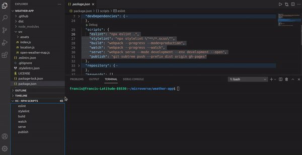

# Handy Commands

A VSCode extension for organizing frequently run commands.
Sometimes we forget that command we want to run and we will leave our development environment to search for it. That is not productive. With Handy Commands, you organize them in groups of related commands and run them with a click of the mouse. If some part of the command changes from run to run, paste and edit it in the terminal. If you no longer frequestly use a command, delete it. And by organizing them into groups, they will not clutter your workspace.

As a bonus in v0.0.2, it automatically imports all the scripts from your package.json and puts them in their own group (Npm Scripts). It watches changes to package.json and updates this group as the scripts changes.

## Features

- Add a group to your collection. (Extension is prepopulated with scripts from package.json)
- Add command items to the group. A command item consists of a command and the label.
- Add more groups and commands.
- Select a group to load its commands in the view.
- Run a command by clicking it's node.
- Paste a command by clicking the paste icon.
- Delete commands and groups as needed.
- Be more productive.

## Requirements

#### VSCode >= 1.55.0

## Extension Settings

#### None

## Known Issues

#### Currently None

## Release Notes

### Version 0.0.2

## Change Logs

- v0.0.2 Added importing npm scripts from package.json. Npm Scripts is now reserved as the name of this group and cannot be used when creating a new group. Also you can neither delete the group nor commands from it.

- v0.0.3 Groups are moved to the Treeview. On clicking the group node, the Treeview is refreshed with populated with the commands in the group. A back button is provided to go back to the group view.

## Author Details

👤 **Obetta Francis**

  

## 🤝 Contributing

Contributions, issues and feature requests are welcome!

Feel free to check the [issues page](https://github.com/chasscepts/handy-commands/issues).

## Show your support

⭐ Star this project on [GitHub](https://github.com/chasscepts/handy-commands/) — it helps!

## Acknowledgments

- Microverse Community.

## 📝 License

This project is [MIT](./LICENSE) licensed.
